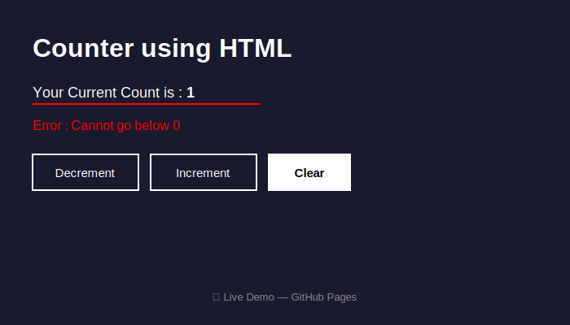

# 🔢 Counter using HTML

A simple interactive counter page built with **HTML, CSS, and JavaScript** — deployed on GitHub Pages.

---

## 📸 Preview



---

## 🚀 Live Demo

👉 [Click here to view the live app](https://YOUR-USERNAME.github.io/counter-app/)

> Replace `YOUR-USERNAME` with your actual GitHub username after deployment.

---

## ✨ Features

| Feature | Description |
|---|---|
| ➕ Increment | Increases count by 1 on each click |
| ➖ Decrement | Decreases count by 1 (not below 0) |
| 🧹 Clear | Resets count to 0 |
| ❌ Error Message | Shows red error if decrement attempted at 0 |
| 👁️ Clear Button | Hidden when count = 0, visible when count > 0 |

---

## 📁 Project Structure

```
counter-app/
├── index.html     # Main counter page
├── preview.svg    # App preview image
└── README.md      # Project documentation
```

---

## 🛠️ How to Deploy on GitHub Pages

1. **Create a new repository** on GitHub named `counter-app`

2. **Upload files** — push `index.html`, `preview.svg`, `README.md` to the `main` branch

3. **Enable GitHub Pages:**
   - Go to your repo → `Settings` → `Pages`
   - Under **Source**, select `main` branch and `/ (root)` folder
   - Click **Save**

4. **Access your site** at:
   ```
   https://YOUR-USERNAME.github.io/counter-app/
   ```

---

## 💻 Tech Stack


---

## 📌 Made by Chandan
